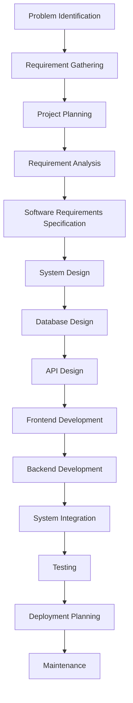

# Cattle Farm Management System — Documentation Repository

This repository contains the complete Software Development Life Cycle (SDLC) documentation for the **Cattle Farm Management System**, developed as a Web Application course project. The system is designed to streamline cattle farm operations by providing a centralized platform for managing livestock, health records, sales, financial transactions, customer inquiries, and farm administration.

---

# 📖 Project Purpose

The objectives of this documentation are to:

1. Document the complete Software Development Life Cycle (SDLC).
2. Present a structured Requirements Engineering process.
3. Maintain traceability from requirements to implementation.
4. Demonstrate software design, database planning, and API architecture.
5. Serve as comprehensive academic and project documentation.

---

# 👨‍💻 Developer

| Member | Student ID | Role | Responsibility |
|---------|------------|------|----------------|
| **Md. Rifat Khan Sakil** | **2030743** | Full-Stack Developer | Requirements Engineering, UI Development, Backend API Development, Database Design, Testing, Documentation, Deployment Planning |

---

# 🔄 Software Development Life Cycle (SDLC)



---

# 🛠 Technology Stack

| Layer | Technology |
|--------|------------|
| Frontend | React.js |
| Backend | FastAPI |
| Database | MongoDB |
| Programming Languages | JavaScript, Python |
| API Style | REST API |
| Version Control | Git & GitHub |
| Development Environment | Visual Studio Code |
| API Testing | Swagger UI |
| Deployment | Planned |

---

# 👥 System Roles

| Role | Description |
|------|-------------|
| Administrator | Manages the entire farm system, livestock records, users, sales, expenses, and reports. |
| Farm Staff | Updates cattle information, vaccinations, breeding records, and daily farm activities. |
| Customer | Sends inquiries and views available cattle information. |

---

# 🚀 Core Modules

| # | Module |
|---|--------|
| 01 | Authentication & Authorization |
| 02 | Dashboard |
| 03 | Cattle Management |
| 04 | Breed Management |
| 05 | Vaccination Management |
| 06 | Health Record Management |
| 07 | Breeding Management |
| 08 | Customer Inquiry Management |
| 09 | Sales Management |
| 10 | Expense Management |
| 11 | Employee Management |
| 12 | Reports & Analytics |
| 13 | REST API Development |
| 14 | Database Management |
| 15 | System Testing |
| 16 | Documentation |

---

# 📂 Repository Documentation

| # | Document | Description |
|---|----------|-------------|
| 01 | [Project Overview](./01-project-overview.md) | Project objectives and overview |
| 02 | [Problem Statement](./02-problem-statement.md) | Existing problems and proposed solution |
| 03 | [Stakeholder Analysis](./03-stakeholder-analysis.md) | Stakeholders and responsibilities |
| 04 | [Information Gathering](./04-information-gathering.md) | Requirement elicitation methods |
| 05 | [Interviews](./05-interviews.md) | Interview findings |
| 06 | [Surveys](./06-surveys.md) | Survey analysis |
| 07 | [Feasibility Analysis](./07-feasibility-analysis.md) | Technical, operational and economic feasibility |
| 08 | [Product Requirements Document](./08-prd.md) | Product requirements |
| 09 | [User Personas](./09-user-personas.md) | User profile definitions |
| 10 | [User Journey](./10-user-journey.md) | User interaction flow |
| 11 | [User Stories](./11-user-stories.md) | Functional user stories |
| 12 | [Acceptance Criteria](./12-acceptance-criteria.md) | Feature acceptance conditions |
| 13 | [Functional Requirements](./13-functional-requirements.md) | Functional requirements |
| 14 | [Non-Functional Requirements](./14-non-functional-requirements.md) | Quality requirements |
| 15 | [Use Cases](./15-use-cases.md) | System use cases |
| 16 | [Data Flow Diagram](./16-dfd.md) | DFD diagrams |
| 17 | [Software Requirements Specification](./17-srs.md) | SRS documentation |
| 18 | [Entity Relationship Diagram](./18-erd.md) | Database ER diagram |
| 19 | [System Design](./19-system-design.md) | System architecture |
| 20 | [Technical Design Document](./20-tdd.md) | Technical implementation |
| 21 | [Database Design](./21-database-design.md) | Collections and database schema |
| 22 | [API Design](./22-api-design.md) | REST API specification |

---

# 🏗 System Architecture

```
                    React.js Frontend
                           │
                    REST API Requests
                           │
                     FastAPI Backend
                           │
                    Business Logic Layer
                           │
                      MongoDB Database
```

---

# 📁 Project Structure

```
Web_App_Project/

│── frontend/
│   ├── src/
│   ├── public/
│   ├── package.json
│   └── vite.config.js
│
│── backend/
│   ├── routers/
│   ├── models/
│   ├── database.py
│   ├── main.py
│   └── requirements.txt
│
│── documents/
│   ├── 01-project-overview.md
│   ├── ...
│   └── 22-api-design.md
│
└── README.md
```

---

# ⚙ Installation

### Clone Repository

```bash
git clone https://github.com/RifatKhanSakil/Web_App_Project.git
```

### Frontend

```bash
cd frontend
npm install
npm run dev
```

### Backend

```bash
cd backend
python -m venv .venv

# Windows
.venv\Scripts\activate

pip install -r requirements.txt

python -m uvicorn main:app --reload
```

---

# 📡 API Documentation

Once the FastAPI server is running:

```
http://127.0.0.1:8000/docs
```

Swagger UI provides interactive API testing and endpoint documentation.

---

# 🎯 Project Goals

- Digitize cattle farm operations.
- Improve livestock management efficiency.
- Maintain accurate vaccination and health records.
- Simplify sales and expense tracking.
- Manage customer inquiries efficiently.
- Generate meaningful reports for decision making.
- Provide a scalable foundation for future enhancements.

---

# 🔮 Future Enhancements

- Online cattle marketplace
- Online payment integration
- Mobile application
- SMS & Email notifications
- QR code identification for cattle
- AI-based cattle health prediction
- Farm performance analytics
- Cloud deployment

---

# 📜 License

This repository is developed for academic purposes as part of a university Web Application course project.

---

# 📌 Repository Status

✅ Requirements Engineering Completed

✅ SDLC Documentation Completed

✅ Database Design Completed

✅ API Design Completed

🚧 Frontend Development In Progress

🚧 Backend Development In Progress

🚧 Testing & Deployment Pending
